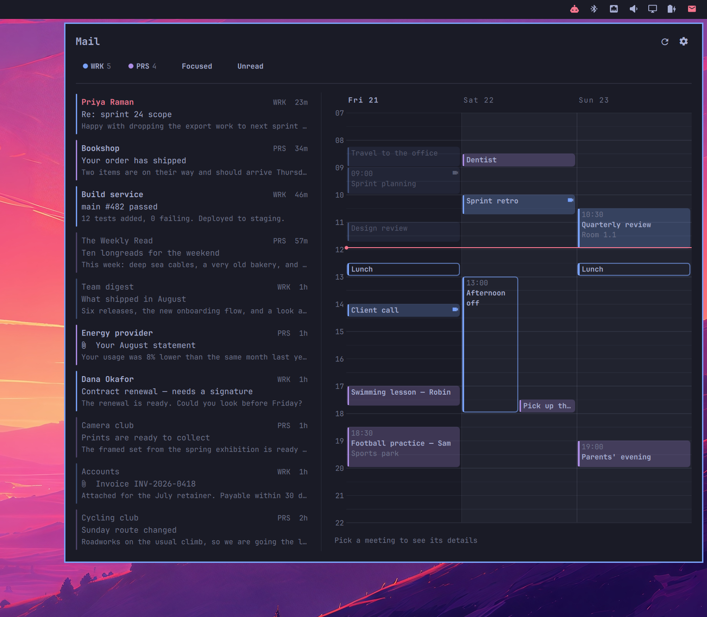
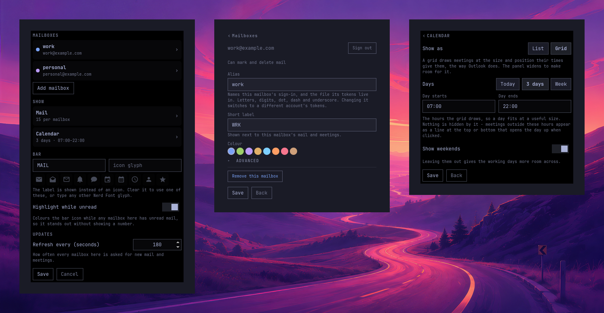
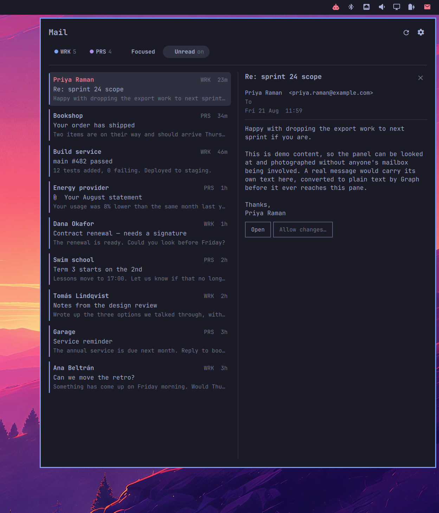

# Office 365 Mail & Calendar for Omarchy

An Omarchy bar widget showing unread Outlook mail and your upcoming agenda,
side by side in one popup.

A widget can carry **one mailbox or several**. With several, mail and calendars
merge into one overview and a coloured rail on each row says which mailbox it
came from. Add the widget more than once when you would rather keep a mailbox
on its own icon - the two styles mix freely.

Works with Microsoft 365 (work/school) and Outlook.com (personal) accounts.



## Install

```bash
omarchy plugin add https://github.com/keesschollaart81/omarchy-office365.git --enable
```

Then add an instance to the `bar.layout` section of
`~/.config/omarchy/shell.json`. The bare minimum is the id - click the widget
and it opens straight on the form that adds your first mailbox:

```json
{ "id": "caseonline.omarchy.office365", "label": "MAIL" }
```

Or write the mailboxes out by hand:

```json
{
  "id": "caseonline.omarchy.office365",
  "label": "MAIL",
  "mails": 5,
  "calendar": "3day",
  "accounts": [
    { "account": "work", "short": "WRK", "color": "blue" },
    { "account": "personal", "short": "PRS", "color": "magenta",
      "webUrl": "https://outlook.live.com/mail/" }
  ]
}
```

Click the widget and press **Sign in** next to a mailbox. The device code is
copied to your clipboard and shown in a notification, the sign-in page opens
in your browser, and you paste the code there. (Opening the browser closes the
popup, which is why the code does not only live in it.) Each mailbox signs in
once, on its own, and a notification tells you which address arrived.

Everything after the first mailbox can be added from the gear - there is no
need to come back to this file.

Requirements: Omarchy with the Quickshell-based shell, `python3` (standard
library only - nothing to install).

## Settings



Click the **gear** in the popup. It opens an index of pages rather than one
long form:

- **Mailboxes** - add or remove one, and open a mailbox to sign it in or out,
  pick its colour, or set its web address, focus match and app registration
- **Mail** - how many messages, whether to start on Focused, the body preview
  line, and whether opening a message marks it read
- **Calendar** - list or grid, how many days, the hours a grid draws, weekends
- Below those, the bar label or icon and how often to check for new mail

Save writes straight into this widget's entry in `shell.json` and the bar picks
it up immediately.

Every key can also be edited by hand in the widget's entry in `shell.json`, so
two instances can differ completely.

Widget-level keys:

| Key | Default | What it does |
|---|---|---|
| `accounts` | - | The mailboxes this widget carries; see below. A widget with none opens on the form that adds one. |
| `icon` | `󰇮` | Nerd Font glyph shown in the bar - one for the whole widget. The settings form offers a few to pick from. |
| `label` | - | Short text shown instead of the icon, e.g. `MAIL`. |
| `mails` | `5` | How many mail rows the panel shows (1–25). Each mailbox is fetched to this depth once per combination of the panel's filters - newest, newest unread, newest Focused, and newest that are both - so the list fills to this number whichever mailbox the newest mail is in, and whichever filters are on. A query the server refuses leaves its own view short, and says which one. |
| `dedupeEvents` | `true` | Show a meeting you were invited to from two mailboxes once, carrying both colours. Matched on the invitation's own identifier, so two people's simultaneous "Lunch" stay two meetings. |
| `calendar` | `3day` | Agenda range: `1day`, `3day` or `week`. |
| `agendaView` | `list` | `list` or `timeline` - a day-grouped list, or a drawn time grid. |
| `dayStart` | `07:00` | Top of the grid. |
| `dayEnd` | `22:00` | Bottom of the grid. |
| `showWeekends` | `true` | Draw Saturday and Sunday in the grid. |
| `refreshIntervalSec` | `180` | How often to poll Microsoft Graph (60–3600). |
| `pausePolling` | `true` | Stop polling while the screen has been idle five minutes or there is no network. Doubles the interval on battery. |
| `tintOnUnread` | `true` | Highlight the bar icon while **new** mail is waiting - unread mail that is in the list, meaning among the newest `mails` messages. An unread message further down the mailbox is backlog and leaves the icon plain, so the tint keeps meaning "something arrived" instead of settling in permanently on an inbox nobody empties. The tooltip and the panel header say both numbers: `2 new · 14 unread`. When the mailbox will not say how many are unread, the panel shows `3+` rather than `3`, and `?` rather than claiming none. |
| `notify` | `true` | Desktop notification when new mail arrives. |
| `previewLine` | `true` | Show a line of the message body under each subject. Off gives a two-line row. |
| `focusedByDefault` | `false` | Open with the Focused filter already on, hiding Outlook's Other mail. |
| `unreadByDefault` | `false` | Open with the Unread filter already on, for a widget you keep as an inbox rather than a record of everything that arrived. |
| `markReadOnOpen` | `false` | Mark a message read once you open it in the panel. Needs permission to change mail, per mailbox. |
| `agentHandover` | `true` | Whether `a` and the **Ask agent** button are there at all, and whether a draft reply from an agent is accepted. |
| `instance` | written for you | Identifies this widget among several. Written the first time you save, and read back on the next save so two widgets holding the same mailbox never write into each other's settings. Nothing to set by hand. |

Per-mailbox keys, inside an `accounts` entry:

| Key | Default | What it does |
|---|---|---|
| `account` | - | **Required.** Unique alias for this mailbox, e.g. `work`. Sign-in state is stored per alias, in a file named after it, so an alias may only hold letters, digits, dot, dash and underscore - anything else is refused rather than stripped, since `work/a` and `work-a` reduced to the same filename would share one mailbox's tokens. |
| `short` | from alias | Two or three letters shown next to each of this mailbox's rows. |
| `color` | auto | A theme colour name - `blue`, `green`, `magenta`, `yellow`, `cyan`, `orange`, `red`, `brown` - or a `#rrggbb`. Resolved from your theme, so it re-tunes when you switch themes. |
| `webUrl` | `https://outlook.office.com/mail/` | Opened when you click the popup header. Use `https://outlook.live.com/mail/` for Outlook.com. |
| `openCommand` | - | Argv array for opening links, with `{url}` substituted, so each mailbox opens in its own browser profile. It also opens that mailbox's sign-in page, which is what makes the right account come up. Edit in `shell.json` - it is a command with arguments, so the settings form leaves it alone. |
| `focusMatch` | - | Window class/title regex. When set, clicking the header focuses that window instead of opening the web app. |
| `clientId` | bundled | Your own Entra app registration, for tenants that require one. |
| `authority` | `common` | `common`, `organizations`, `consumers`, or a tenant id. |

A fuller widget: three mailboxes merged, each opening its links and its
sign-in page in its own Edge profile, and focusing that profile's window.

```json
{
  "id": "caseonline.omarchy.office365",
  "label": "MAIL",
  "mails": 5,
  "calendar": "3day",
  "accounts": [
    { "account": "work", "short": "WRK", "color": "blue",
      "openCommand": ["microsoft-edge-stable", "--profile-directory=Profile 1", "{url}"],
      "focusMatch": "msedge-outlook.office.com__mail_-Profile_1" },
    { "account": "family", "short": "FAM", "color": "cyan",
      "openCommand": ["microsoft-edge-stable", "--profile-directory=Profile 3", "{url}"],
      "focusMatch": "msedge-outlook.office.com__mail_-Profile_3" },
    { "account": "personal", "short": "PRS", "color": "magenta",
      "webUrl": "https://outlook.live.com/mail/",
      "openCommand": ["microsoft-edge-stable", "--profile-directory=Default", "{url}"] }
  ]
}
```

A widget written with a single top-level `account` string instead of an
`accounts` list still works, and is read as a one-mailbox list. It is only
rewritten if you save from the settings form.

## Notifications

New mail raises a desktop notification: who it is from, and the subject. More than three arriving in one poll become a single summary instead of a stack. With several mailboxes, or a folder that is not the inbox, the notification says which one it landed in.

What counts as new is *new since the shell started watching*, not *unread*. The first answer after a sign-in — or after a laptop wakes up to a morning of mail — is an entire mailbox at once, and announcing all of it is what makes people turn notifications off for good. So the first poll of each mailbox primes quietly and only what turns up after it is announced. A mailbox with notifications switched off is still watched, so switching them on later does not announce the backlog.

The announcement is made by the store, which is the one thing there is exactly one of: the bar widget and the window watching the same inbox share one fetch, and so share one notification rather than raising two.

Clicking the notification opens that message: the right mailbox, the right folder, and the message in the reading pane. Several messages in one conversation update one notification rather than stacking, and the click still works after the shell has been restarted underneath it — the action travels as data on the notification rather than as a callback into the process that sent it.

## When it does not poll

A poll is not free. It is a token refresh and a round trip, and on a mailbox with a rate limit it is part of a budget — so it stops when there is nobody to poll for. Nothing is asked of the server while the screen has been idle for five minutes, or while the machine has no network at all, and a fetch goes out the moment you come back or reconnect rather than at the next tick. Idle inhibitors count as being present, so a full-screen call does not look like an empty desk. On battery the interval is doubled, and tripled in the power-saver profile, because a system asked for less power is asking us for less too.

Anything you ask for by hand still goes out, offline included: a failure you can see beats a silence you cannot. The refresh button's tooltip says why the panel is not moving while it is paused. Set `pausePolling` to `false` to keep the old fixed cadence.

## Filtering

The pills under the title are both the legend for the row colours and the
controls for what is shown, and they appear only once there is mail to filter.
While a mailbox is fetching for the first time the panel shows placeholder
rows at its full width instead, so nothing shifts under the pointer when the
data lands. Click a mailbox to see only its mail and meetings -
the others fade - and click it again, or another one, to change your mind.
**Unread** narrows the mail list to what you have not read yet, and
**Focused** hides what Outlook sorted into Other. Press **u** and **f** to
toggle them from the keyboard, and set `focusedByDefault` to open on Focused
every time.

**Focused/Other is Outlook's own split, and Graph is the only way to it.** A
mailbox signed in over IMAP has no such thing, so the pill is not offered
there at all rather than sitting on a filter that would quietly do nothing;
`f` does nothing there either, and the keyboard help does not promise it. With
a Graph mailbox and an IMAP one on screen together the pill stays and says
whose mail it cannot speak for - `Focused  FWU: all` - because that mail is
still in the list and a filter that seems to have missed some is worse than
one that says what it left.

Both fill the list to `mails`: each mailbox is fetched three ways - newest,
newest unread, and newest Focused - so whichever way you narrow it, there is
enough to show.

## How long the list is

`mails` is the bar panel's list, where seven is plenty. The window opens on
twenty and asks for twenty more every time you reach the end of it, up to a
hundred per mailbox - reading is what asks for the next page, there is nothing
to press. It stops at a hundred because past that every poll would be
re-reading the whole mailbox for a list nobody scrolled to, and search is the
better tool for going further back.

The fetch is shared with the bar widget, so a window paged to a hundred would
have the background poll reading a hundred as well - which is why the window
drops back to `mails` the moment it closes. The filtered views behind the list
(unread, Focused) stay at twenty-five whatever the page grows to: nothing is
lost inside the page itself, since the unread among the newest hundred arrive
with the newest hundred.

## Folders

The sidebar's folders can be made and unmade, in either transport:

| | |
|---|---|
| **New** / `n` | A folder inside the one under the cursor. `N` makes one at the top level instead |
| **Rename** / `R` | The same folder, under another name |
| **Move** / `m` | Put it under another folder, or back at the top level. Everything inside it comes along |
| **Delete** / `x` | The folder and the mail in it |

The keys are the folder tree's own: `n`, `R`, `m` and `x` mean folders while
the cursor is in the sidebar and messages everywhere else, which is how `m`
already worked. The buttons under the tree do the same four things for the
pointer, and both act on the folder under the cursor - or, before the keyboard
has been in the tree, on the one being read.

Two things are refused before anything is sent: the inbox cannot be renamed,
moved or deleted, and a folder cannot be moved inside itself or one of its own
children. On IMAP a folder with folders inside it will not delete either -
RFC 3501 lets a server either refuse that or leave an unusable husk behind,
and neither is something to discover afterwards.

**Deleting is not the same thing on the two transports, and the prompt says
which one you are looking at.** Outlook puts the folder and its mail in
Deleted Items, where it can be dragged back out. IMAP has no wastebasket for
folders: `DELETE` takes the messages with it and they do not come back.

Rearranging means re-parenting, because that is the only ordering either
server has: Outlook and IMAP both list folders alphabetically and neither
stores a hand-made order.

All four need the mailbox signed in with permission to change mail. Without
it the window says so rather than doing nothing.

Filters are a way of looking at the panel now rather than a setting: closing
and reopening it starts from the whole picture again.

Every mailbox is on some folder at all times — its inbox until you pick another
— but only one of them is where you are, so only that one is lit in the
sidebar. A highlight in each account reads as several things open at once when
only one of them is what you are looking at.

### All mailboxes at once

With more than one mailbox, the tree opens with an **All mailboxes** group
above the per-mailbox trees — Inbox, Archive, Sent, Drafts, Junk, Deleted —
and each row means that folder in *every* mailbox at the same time. The inbox
row carries the merged unread count, and the window's title says "Inbox — all
mailboxes" so a list holding three mailboxes is not labelled with one address.

That is the state the window opens in, and before this there was no way back to
it: clicking a folder under one mailbox left the others on their inboxes, and
nothing said so. Picking a merged row moves all of them together.

It works by the folder's well-known name rather than its id, because no id
means the same folder in two mailboxes. Graph takes those names in a folder
path already; over IMAP they are matched against the mailbox's own folder
names, which arrive in its own language. A mailbox whose Archive is called
something the plugin does not recognise says so and shows its inbox — set it in
`imapFolders` to fix that.

## Conversations

**Threads** - in the window, and press **t** - folds the list by conversation.
A conversation of more than one message collapses to a summary row: who is in
it, the newest subject, and how many messages are behind it, tinted while any
of them is unread. Click the row to open it and the messages appear under it,
newest first; click one to read it. A conversation of a single message is
still drawn as that message, because a fold with nothing behind it only costs
a click.

Both transports thread, and they do it differently. Graph keeps the
conversation itself and hands over its id. IMAP has what RFC 5322 has always
had - a `Message-ID` per message and a `References` header naming the ones it
answers - so the panel rebuilds the relation from those. Nothing is ever
grouped by subject: two strangers replying to "Re: Rechnung" are two
conversations, and a rule that cannot tell them apart is worse than no
threading at all.

Only what was fetched can be grouped, so the count on a row is how many of the
conversation you have here, not a claim about the whole thing on the server.
The cap in `mails` counts conversations rather than messages while this is on -
everything fetched is grouped first, and the newest `mails` conversations are
what the list shows - so turning it on does not thin the list out.

## The agenda

It is in both surfaces: the bar's popup has had mail beside the agenda from the
start, and the window now has it too - in the reading pane's column, where it
stands until a message or a meeting is opened. That column used to say "Select
a message" at a third of a window's worth of empty space.

On a window too narrow for a reading pane - a tiling compositor hands this
one whatever width is left, and half a screen is not enough for three columns
- there is no reading pane for the agenda to stand in, and there was no way to
reach it at all. Now there is: press `C`, or click the calendar glyph in the
header, and the agenda takes the mail list's column for as long as you are
looking at it, the way an opened message does. A message you had open stays
open behind it, and `Escape` brings it straight back.

The agenda column is a day-grouped list by default, and can be a drawn
time grid instead - hours down the side, days across, meetings at the size and
position their times give them. Switch with **Show as** on the settings form's
Calendar page, or `"agendaView": "timeline"`. The grid is the one at the top of
this page.

The grid draws whatever range `calendar` is set to. The panel widens to make
room for it - a week is a wide popup - so that mail and calendar are always
both on screen, and it is capped at four fifths of the display.

Colour still means which mailbox, so blocks are tinted rather than filled: a
meeting from two mailboxes carries both colours down its edge. Meetings marked
free in Outlook are drawn as an outline, so a birthday blocking six hours does
not read as six hours of meetings. The past is dimmed rather than hidden, and a
line marks the current time.

**Hours** bounds what the grid draws - 07:00 to 22:00 by default - so a day
fits at a useful size. Nothing is hidden by it: anything outside appears as a
line at the top or bottom saying how many, which opens the day up when clicked,
for as long as the panel stays open. All-day and multi-day events sit in a band
above the grid, spanning the days they cover.

Clicking a meeting selects it and describes it in the bar underneath rather
than opening it straight away, since a grid is too dense to be sure of a click.
Escape clears the selection.

## Opening a meeting, and answering it

**Details** on the strip under the grid - or a click on a row in the list -
opens the meeting where the agenda was, the same place a message opens. That is
where the questions an agenda cannot answer get answered:

- **When, where, and who called it**, with the organiser's address.
- **What you answered**, said in a line rather than left to be inferred: *You
  are going*, *You answered maybe*, *You declined*, *You have not answered*.
- **Who else is coming.** A count first - `4 of 7 going · 1 maybe · 1
  declined` - because that is the answer to "is this happening", and then the
  names, each with a mark for what they said. Optional attendees say so.
  Marks are shapes, not only colours: `✓` going, `?` maybe, `✕` declined, `★`
  the organiser.
- **What the organiser wrote**, converted to text with its links kept - so the
  join link in an invitation is clickable even where the meeting has no
  **Join** button of its own.

And then the thing that used to mean leaving for Outlook: **Accept**, **Maybe**
and **Decline**. The answer is sent to the organiser - always, because an
answer nobody was told about is indistinguishable from no answer from where
they are sitting, so "accept without sending a response" is deliberately not
offered here. Whichever answer you have already given is left off the bar
rather than drawn as a button that does nothing, and the calendar is re-read
afterwards, since declining a meeting takes it out of your calendar.

The buttons appear only where there is something to answer: a meeting somebody
else called, that has not been cancelled, and that you are not the organiser
of. An appointment you put in your own calendar has nobody to answer.

Both transports can do this. On a Graph mailbox it is that API's own verb per
answer; on a mailbox read over IMAP it goes through EWS, which has no such verb
and instead has the response created and sent as an item - which amounts to the
same thing on the organiser's tally.

## Teams meetings

A meeting with an online link gets a **Join** button - on its row in the list,
and in the bar under the grid once it is selected. On the grid itself a small
camera marks the blocks you can join. Joining opens the link through that
mailbox's `openCommand`, so it lands in the browser profile that is already
signed in as the right person.

## Reading a message



The reading pane offers the same actions in the dropdown as in the window. The
ones the dropdown cannot carry out itself — Reply, Reply all, Forward, Move and
Ask agent — open the window on that message with the action already started,
and say so in their tooltips. A popup that closes the moment you click away is
no place to write a reply.

Clicking a mail opens it in the right-hand column, in place of the agenda:
sender, recipients, when it arrived, and the message as plain text. **Open**
hands it to Outlook - the browser profile you gave that mailbox, if you set
one. Click the message again, the ✕, or press Escape to go back to the agenda.

Bodies are fetched one at a time, only when you open a message, and long ones
scroll inside the pane rather than stretching the popup.

**The files a message carries** are listed under the headers, with their sizes.
Clicking one saves it into your download folder and opens it, the way clicking
an attachment works everywhere else; `s` saves all of them without opening
anything. A file that is already there is not overwritten - the second copy is
`name (2).pdf`, because you may still be reading the first. Names and sizes
cost nothing on a mailbox read over IMAP, where the source has already been
fetched, and one request on the Graph path, made only for a message that says
it has something. Nothing is fetched until you click.

A message read over IMAP is read to two megabytes, which is where the pane
stops; a file past that point is missing from the list rather than merely
unopenable, and the pane says so rather than showing the message as carrying
nothing. Two kinds of Outlook attachment cannot be saved from here and say
which they are: a message attached to a message, and a link to a file on
OneDrive.

**Flag** raises Outlook's own follow-up flag on the message, and **Unflag**
clears it - the flag Outlook draws in its own column, so a message flagged here
is flagged in Outlook and on the phone. Over IMAP it is the `\Flagged` keyword,
which is the same thing by another name. Flagged rows carry a flag beside the
time and keep it once read, which is the point of a flag: it outlives having
been read. A collapsed conversation wears one if any message in it does.

Flagging is a write, so it needs the same permission marking and moving do -
see [Sign-in and your data](#sign-in-and-your-data).

### Answering it, and writing one of your own

A forward carries what the original was carrying. On the Graph path Outlook
builds the forward out of attachments already in the mailbox, and always did;
over IMAP the message is assembled here, and for a long time it was assembled
out of the original's text alone - the files were dropped, nothing said so, and
the forward looked complete in Sent Items. Now they ride along, up to 25 MB,
which is roughly where a mail server stops taking them; past that it is refused
by name rather than sent short, and so is a message too large to be read in
full. The notice after sending says how many files went with it.

**Reply**, **Reply all** and **Forward** lead the row of buttons under a
message, and a box opens under the message rather than over it — quoting from
a message you can no longer see is how the wrong thing gets quoted. Shift+Enter
or Ctrl+Enter posts it, Escape backs out, and Enter is a newline.

They used to be there and be unreachable. The row keeps what fits and puts the
rest behind a **+n more**, ordered by priority, and the priority had **Open**
first, the formatting offers next and **Forward** somewhere after **Mark read**
— so on the window's reading column all three answers sat behind a **+8 more**
on any message with markup in it. Answering the message is what a message that
has just been read is for, so the three of them come first now and **Open** —
which leaves for Outlook — went down with the rest.

Addresses complete as you type, in both **To** and **Cc**: the suggestions
come from mail that has already arrived and messages you have opened, so they
are the people you actually correspond with, ranked so a name that *starts*
with what you typed beats one that merely contains it. `↓`/`↑` move, `Tab` or
`Enter` accepts, `Escape` closes the list (and a second `Escape` backs out of
the message). Nothing is fetched to build it and nothing is written down —
Graph's contacts endpoints need consent this plugin does not ask for, and an
IMAP mailbox has none at all, so a book from either would have been empty on
half the mailboxes here.

**Write** in the window's top-right corner, or `c`, starts a message that
answers nothing: **To**, **Cc**, a subject, and the reading column to write it
in. It goes out from the mailbox you are reading, which the line above the box
names, since a window can be carrying several. This was the plugin's biggest
hole — writing a fresh mail meant leaving for Outlook — and it is closed on
both transports: Graph sends the whole message in one request to `/sendMail`,
and over IMAP it is assembled here and handed to SMTP, with a copy filed in
Sent Items because client submission does not do that for you.

A new message carries no `In-Reply-To`: it starts a conversation rather than
joining one, and a reference to nothing would have some clients file it under a
thread that does not exist.

Sending needs permission the plugin does not ask for by default — see
[Sign-in and your data](#sign-in-and-your-data). **Save as draft** needs less
than sending does and is always offered, so a mailbox signed in for reading and
writing can still write the message and finish it in Outlook.

### Sending a file with a reply

**Attach** in the reply box picks a file, and what is attached shows as a chip
above the buttons with an ✕ to take it off again. It works on a reply, a reply
to all and a forward, on both transports, and on a draft as much as on a send -
a draft finished in Outlook opens with the files already on it.

Up to 3 MB in total, and that number is not arbitrary: Graph carries an
attachment inside the request that creates it, the request may be 4 MB, and
base64 costs a third on top. Past that the documented route is an upload session
on an Outlook host this plugin does not talk to, so the refusal says so instead
of failing at the wire. The same cap applies over IMAP, because a plugin that
took 3 MB one way and twenty the other would be a worse promise than one number.

There is one thing worth knowing about how it is sent over Graph. `/reply`,
`/replyAll` and `/forward` take a comment and recipients and nothing else -
there is nowhere to put a file. So a message with something attached is built as
a draft, the files go onto it, and the draft is sent: three requests instead of
one, and only for a message that needs it. If the attaching fails, the draft is
left in Drafts with whatever did attach, and the error says so - it is somewhere
you can finish it, which "could not send" would not have told you.

### Formatting, and the button that turns it on

Every message opens as text. Not because markup is dangerous here - everything
that could fetch or run is stripped before the pane ever sees it - but because
a reading pane is for reading, and most mail is words wrapped in somebody
else's layout. So the pane shows the words, and offers the layout:

- **Show formatting** renders this one message as its sender wrote it -
  headings, lists, tables, and the pictures it carries with it. **Plain text**
  is the way back. Neither is remembered; the next message opens as text again.
- **Always from this sender** remembers it for that address, so their mail
  opens formatted from then on. **Stop for this sender** forgets it again. The
  list lives in the widget's settings as `htmlSenders`, so it survives a
  restart and can be read or emptied there.
- **Always keep the message's own formatting** in the settings is the old
  behaviour, for anyone who wants every message formatted and no buttons.

There is one message the pane does not ask about: **one that carries no
plain-text version at all**. Half of what arrives from a marketing system is
markup and nothing else, and flattening that gives a page of run-together link
labels rather than a letter. So it is shown as it was written, with a line
under it saying why. Nothing is fetched from the sender to do it - the same
sanitiser runs, and remote pictures are still blocked and counted.

A message does not get to choose a colour the pane cannot draw. Outlook and
Word write `color: black` into practically every span they emit, because they
are laying the message out on white paper — so on a dark theme a formatted
message arrived as black text on a near-black background, readable only by
selecting it. Each colour a sender chose is now measured against the background
it is actually being drawn on, and dropped if it cannot be read there, which
lets that text fall back to the theme's own foreground. A colour that *is*
readable is theirs to keep: the orange they used for a warning and the blue
they used for a heading survive. Painted backgrounds do not — the pane supplies
the background, and with none of the sender's left there is exactly one thing
every colour has to be legible against.

Formatting and pictures are separate decisions on purpose. Showing a message's
layout costs nobody anything; fetching the pictures it points at on the
sender's servers tells them you opened it, and that stays behind its own
button - see [Sign-in and your data](#sign-in-and-your-data).

Over IMAP the pane knows exactly what a message carries, because it reads the
MIME parts itself. Over Graph it does not: Graph keeps one body per message and
converts on request, so "was there a plain-text part" is a question it cannot
be asked. On that transport the button is therefore always offered, and a
message with no formatting simply shows the same words again.

### Links

Graph hands a message over as plain text unless the formatting is asked for,
and its
HTML-to-text conversion leaves every link in a form nothing can use: the words
buried behind two hundred characters of Defender safelink, or run straight into
the text in front of them. So the links go back in as links, built here out of
the message's own escaped text - which is why this needs none of the
sanitising an HTML body does; nothing a sender wrote can become markup.

A link shows what it is rather than where it goes. A safelink is displayed as
the address it really stands for, and a long one as its host and last segment -
`contoso.sharepoint.com/…/Report.docx`. What gets **followed** is always the
original, safelink included, so the tenant's own checking still runs. Hovering
a link puts the whole address under the message, since the visible text is
shortened and that is the only place to read it in full.

**Mark read / unread** and **Delete** sit next to Open, but only for a mailbox
that has granted permission to change mail - see below. Delete moves the
message to Deleted Items, so it stays undoable from Outlook, and opens
whichever message takes its place in the list so you can keep going down it.

In the window there is a **Move…** button beside them, and `m` on any row does
the same without opening it first. Both put this mailbox's folder tree over the
window; pick one with the mouse or with `j`/`k` and `Enter`, and `Escape` files
nothing. The folder the message is already in is not offered, and neither is
another mailbox's tree - Graph moves a message within one mailbox, never
between two. The row leaves the list the way a deleted one does, the next
message opens in its place, and the header says where it went.

## Keyboard

Give a widget an IPC name and a keybinding can summon it:

```json
{ "id": "caseonline.omarchy.office365", "ipcTarget": "mail", "...": "..." }
```

```lua
-- ~/.config/hypr/bindings.lua
o.bind("SUPER + N", "Mail", "omarchy-shell mail toggle")
```

The name is yours to choose and must be unique across widgets; without one
the widget registers no handler at all, so several of them cannot collide.
`open`, `close` and `toggle` are all accepted.

Once the bar panel is up:

| Key | What it does |
|---|---|
| ↑ ↓ (or k / j) | Move through the mail list |
| Enter or Space | Read the message under the cursor |
| f | Show only Outlook's Focused mail, or stop |
| u | Show only unread, or stop |
| Delete, Backspace or x | Delete it - the mailbox must allow changes |
| Escape | Close the reading pane, then the panel |
| Tab | Move to the next bar panel |

### In the window

Press `?` in the window for this list without leaving it.

The window is a focus ladder rather than a bag of shortcuts: **calendar →
folders → mail → message**. `h` and `l` step between the rungs, `Escape` walks
back out one rung at a time, and `j`/`k` always mean "down and up in whatever has focus" -
including inside a message, which is the one place they used to do nothing.

| Key | What it does |
|---|---|
| `j` / `k`, `↓` / `↑` | Down and up in whatever has focus: the folder tree, the list, or the message |
| `Enter` | Open the message, and move focus into it |
| `h` / `←` | Back a rung: message to list, list to folders, folders to the calendar |
| `l` / `→` | In a rung: calendar to folders, folders to list, list to message |
| `C` | The calendar, from anywhere. `Escape` brings the mail back (capital, since `c` writes a message) |
| `Tab` | Between the folder tree and the list |
| `Escape` | Back one step: reply → folder tree → calendar → message → reading pane → window |
| `Page Up` / `Page Down` | A screenful of whatever has focus |
| `Ctrl-u` / `Ctrl-d` | Half a screen |
| `Ctrl-b` / `Ctrl-f` | A screen |
| `g` / `G` | To the top / to the bottom |
| `x` | Delete the message under the cursor |
| `m` | Move it to another folder |
| `c` | Write a new message from the mailbox you are reading (`c` for compose, since `r` refreshes) |
| `s` | Save every file this message carries into your download folder |
| `a` | Hand this message to your coding agent — see below |
| `F` | Flag it for follow-up, or clear the flag (capital, since `f` is the Focused filter) |
| `u` / `f` | Only unread / only Focused |
| `t` | Group the list by conversation |
| `r` | Refresh |
| `?` | This list |

In the folder tree the same letters are about folders — see
[Folders](#folders):

| Key | What it does |
|---|---|
| `n` / `N` | New folder, inside the one under the cursor / at the top level |
| `R` | Rename it (capital, since `r` refreshes) |
| `m` | Put it under another folder, or back at the top |
| `x` | Delete it, and the mail in it |

Escape never skips a rung: stepping back from a message to the list leaves the
message open, and only the next Escape closes it.

This is the same ladder the [Teams plugin](https://github.com/janrenz/omarchy-teams)
uses, so what is learned in one window works in the other.

## Your coding agent

Omarchy already knows which coding agent you use — `omarchy default agent`
picks one, `omarchy-agent` launches it. Press `a` on a message, or the **Ask
agent** button in the reading pane, and that agent opens on the message you are
reading.

What crosses over is a pointer, not the mail. The prompt names the mailbox
alias, the folder and the message id, and points at a skill in
`skills/omarchy-office365/`; the agent then reads the message through
`src/graph.py`, the same helper the window uses. Not even the subject is in the
prompt: a subject is content, and an agent window's command line is readable by
anyone on this machine for as long as it lives. It also means the agent reads
the message as it is now, and can read the whole of a long one — the window is
where the body gets truncated, not the helper.

The skill tells it to draft rather than to send. A reply it writes comes back
into the window's reply box, on the right message, unsent:

```bash
omarchy-shell shell summon caseonline.omarchy.office365 \
  '{"draft":{"account":"work","messageId":"AAMkAD…","mode":"reply",
             "text":"Ich schaue morgen früh drauf."}}'
```

The window opens if it was closed, and fetches the folder first when the
message is not in the list. `mode` may be `reply`, `reply-all` or `forward`.
Sending stays a button you press — nothing an agent does here leaves the
mailbox. A mailbox that has not been granted write access refuses the draft
outright, because even a draft is a write as far as Graph is concerned.

`src/handover.sh` is what the key runs, and it is usable on its own: `--print`
shows the prompt instead of launching anything.

Turn the whole thing off with `agentHandover` in the settings and the key, the
button and the help entry are gone, and a draft arriving from an agent is
refused rather than quietly applied.

## Interactions

- **Left click** - open the popup (mail left, agenda right)
- **Right click** - focus the mailbox's app window, or open Outlook on the web
- **Middle click** - refresh now
- **Click a mail** - read it in the right column
- **Trash icon on a row** - delete without opening it first
- **`F`** - flag the row under the cursor for follow-up, or clear its flag
- **Click an event** - open it in Outlook, or select it when the agenda is a grid
- **Join** - open a Teams meeting, in that mailbox's browser profile
- **Click the header** - same as right-clicking the bar icon

## Sign-in and your data

Sign-in uses the OAuth 2.0 **device code** flow against Microsoft Graph and
asks for **read-only** scopes: `Mail.Read`, `Calendars.Read`, `User.Read`.
There is no password and no client secret anywhere.

Marking mail read or unread, moving it, deleting it, and `markReadOnOpen` need
more than that, so a mailbox only gets `Mail.ReadWrite` if you ask for it: **Allow
changes…**, on a message or on that mailbox's settings page, signs that one
mailbox in again with the wider scope. Every other mailbox stays read-only,
and a widget you never grant anything to can never change your mail.

Refresh and access tokens are
stored per account under `~/.local/state/omarchy/office365/`, written
`0600` in a `0700` directory. Nothing is sent anywhere except Microsoft
Graph - no telemetry, no third-party service.

`graph.py` is the only component that ever touches a token; the QML widget
just renders the JSON it prints.

To sign an account out, use the sign-out button in the popup, or:

```bash
python3 ~/.config/omarchy/plugins/caseonline.omarchy.office365/src/graph.py remove --account work
```

### Bring your own app registration

The bundled client id is a multi-tenant public-client registration, and it is
safe to ship in the open: in a device-code public-client flow a client id is an
identifier, not a secret. There is no client secret anywhere in this plugin,
because this kind of app is not allowed one.

It is published by a **verified publisher**, Case Online, so the consent screen
shows the verified badge rather than an unverified-publisher warning, and a
tenant that blocks unverified apps will still accept it.

Some organizations would nonetheless rather own the registration themselves,
for consent control, conditional access or auditing. Create one in Entra ID:

- **Supported account types:** accounts in any organizational directory **and**
  personal Microsoft accounts, if any of your mailboxes are Outlook.com ones
- **Allow public client flows:** enabled - device code will not work without it
- **Delegated Graph permissions:** `User.Read`, `offline_access`, `Mail.Read`,
  `Calendars.Read`, and `Mail.ReadWrite` as well if you want to mark, move or delete
  mail from the panel
- **No redirect URI and no client secret** - the device code flow uses neither

Or with the Azure CLI, signed in to the tenant that should own it:

```bash
az ad app create \
  --display-name "Omarchy Office 365 Mail & Calendar" \
  --sign-in-audience AzureADandPersonalMicrosoftAccount \
  --is-fallback-public-client true
```

Then add the delegated Graph permissions, and set `"clientId"` (and
`"authority"` if you want to pin a tenant) on each mailbox that should use it.
Switching client ids means signing that mailbox in again: tokens belong to the
client id that obtained them.

## Removing it

```bash
omarchy plugin remove caseonline.omarchy.office365
```

That unloads the plugin **and deletes its widgets from your bar layout**,
mailbox list and all - worth a copy of `~/.config/omarchy/shell.json` first if
you might come back.

Tokens live outside the plugin folder and are left alone, so reinstalling does
not mean signing in again; your mailboxes just need adding to a widget once
more. To take the tokens too:

```bash
rm -rf ~/.local/state/omarchy/office365
```

Signing a mailbox out through the panel also revokes nothing at Microsoft's
end; remove the app's access under **My Account -> Apps & devices** if you want
that as well.

## Development

The plugin's own code lives in `src/`; `manifest.json`, the README and the
previews sit at the top so the folder reads as a plugin rather than a pile of
QML. Clone the repo somewhere and symlink it into place:

```bash
ln -s "$PWD" ~/.config/omarchy/plugins/caseonline.omarchy.office365
omarchy plugin validate .
```

The shell's plugin watcher does not follow symlinks pointing outside
`~/.config`, and `omarchy-shell shell rescanPlugins` will not pick those edits
up either - run `omarchy restart shell` after each change.

### The harness

Restarting the bar and reopening a popup for every change is far too slow for
laying out a calendar grid, so `dev/` renders the plugin's own components
against fixture data instead:

```bash
dev/showcase.sh             # regenerate the images in this README
dev/run.sh                  # start it, rendered offscreen
dev/shot.sh out.png         # ask it to draw itself into a PNG
dev/shot.sh out.png 7       # ... as a week
node dev/test-model.js      # the layout maths, with no window at all
python3 dev/test-python.py  # aliases, and which widget a save lands in
```

`showcase.sh` drives the real panel through each scenario with demo data,
finds it by photographing the screen with the panel shut and open and taking
the difference, and pastes it onto the wallpaper so nothing you had open is in
frame. It puts your `shell.json` back on the way out, including if it fails.

Both test suites are quick and neither needs a display, so run them before
sending anything. They cover the parts that fail quietly rather than loudly:
overlap packing, positions on the days the clocks change, which mailbox an
alias names, and which widget entry a save writes into.

It renders **offscreen**, so there is no window to be occluded, sent to another
workspace, or dropped on top of what you were doing - and it draws its own
screenshots rather than being photographed off the display. `dev/shell.qml`
also has an IPC target for switching range, hours, selection and page:

```bash
STAGE=$(dev/link.sh)
qs -p $STAGE/shell.qml ipc call dev page settings
qs -p $STAGE/shell.qml ipc call dev page problems   # a half-working mailbox
qs -p $STAGE/shell.qml ipc call dev hours 06:00 23:00
qs -p $STAGE/shell.qml ipc call dev save fail       # a save the write refused
```

Commons and Ui are linked in from the shell, so it draws with the same `Style`,
`Color` and controls as the real panel. Quickshell will only import modules
from inside its own config folder, so `link.sh` assembles one - under
`$XDG_RUNTIME_DIR`, not in the repo, because Omarchy refuses to load a plugin
folder containing symlinks and building it here would make
`omarchy plugin validate` fail on your own checkout.

The fixtures in `dev/Fixtures.js` are deliberately awkward - overlapping
meetings, all-day events, blocks running outside the working day, one meeting
arriving from two mailboxes, two different meetings that look identical, and a
mailbox that answered without its calendar - since a real account offers those
combinations only on a bad week, and some of them not on demand at all.

Useful while iterating:

```bash
# what the widget renders, straight from the helper (--demo for synthetic data)
python3 src/graph.py fetch --account work --account personal --mails 5 --days 3 | python3 -m json.tool

# QML errors from the running shell
journalctl --user -f | grep -i office365
```

## Changelog

### 1.9.1 — 2026-09-03

- **Deleting a message no longer announces the one that takes its place.** A
  fetch carries as many messages as the widget was asked to show, so the rest
  of the mailbox sits below the fold where the notifier has never seen it.
  Delete a row and the list refills to its cap, pulling one of those up - and
  because it had never been seen, it was announced as new mail. Usually it was
  a message already read: marking read is optimistic, applied here the instant
  you open something, and the round that follows a delete goes out long before
  the server agrees, so the answer still said unread. What is announced is now
  read against the same overlay the lists on screen are drawn from, which is
  the app's own answer to "have you read this" rather than the server's stale
  one. A message deleted here is skipped for the same reason: it can still be
  in the next answer, nothing on screen shows it, and nothing should say it
  arrived. Both are still recorded as seen, so neither can be announced later
  either.

### 1.9.0 — 2026-09-02

- **A forward carries the original's attachments over IMAP.** It never did.
  The message was assembled here out of the original's headers and text, the
  files were left behind, and nothing said so - the forward looked complete in
  Sent Items and arrived without the document it was about. Graph's forward is
  built by Outlook out of attachments already in the mailbox, so that path was
  never affected, which is the worst kind of difference: the same button, doing
  two different things, on two mailboxes in the same window. The original is
  now fetched whole rather than to the reading pane's 2 MB, its files are
  re-attached, and a message that will not fit is refused by name instead of
  sent short. Inline images - the logo a signature points at with `cid:` - are
  left out, because forwarding somebody's letterhead as a document is not
  carrying their attachments.
- **The files a message carries are in the reading pane.** Until now the only
  trace of an attachment anywhere in the plugin was the paperclip on the list
  row: the pane never showed one, nothing ever fetched one, and there was no
  route to the file at all. They are listed under the headers with their sizes
  now. Clicking one saves it to your download folder and opens it; `s` saves
  all of them; an existing file is never overwritten.
- **A reply over IMAP is threaded again.** `In-Reply-To` was read from a field
  the opened message never carried, so every reply from this transport went out
  with no threading headers at all and landed beside the conversation in the
  recipient's client rather than in it. It carries the original's own
  `Message-ID` now, and the `References` chain the original arrived with.
- **A folder tree no longer disappears while a folder opens.** Switching
  folder starts a new fetch, and the mailbox had no data under the new key
  until it answered - so it dropped out of the snapshot entirely and its tree
  collapsed to a single Inbox row for as long as the server took, which on a
  large mailbox is seconds. The tree is the same tree in every folder, so the
  last answer now stands in for it, along with the mailbox's name, what it may
  do and its agenda. The mail itself is not stood in for: those rows are the
  folder you just left, and drawing them under the new folder's name would say
  "this is what is in Archive" about your inbox. The list shows its
  placeholder rows, as it already did.

### 1.8.0 — 2026-09-02

- **The calendar is reachable on a narrow window.** The window's agenda lives
  in the reading pane's column, and a window with no room for a reading pane -
  which is most of them, under a tiling compositor - therefore had no agenda
  and no way to ask for one: closing the message showed the list, and opening
  one showed the message. The calendar is a rung of the focus ladder now,
  outside the folder tree: `C` goes straight there from anywhere, `h` walks out
  to it, and a calendar glyph appears in the header on exactly the widths where
  the agenda has nowhere else to be. It borrows the list's column while you
  read it, a message you had open stays open behind it, and `Escape` brings the
  mail back. `j`/`k`, `g`/`G` and the page keys scroll it.
- **An agenda longer than its pane can be scrolled.** It never could - not by
  keys, not by the wheel. The scroller holds two children, the drawn grid and
  the day-grouped list, and a `ScrollView` works its content size out from a
  single one: with two it measured nothing and decided there was nothing to
  scroll. It is told the size now.
- **The window header no longer disappears when the pills outgrow it.** The
  header's height came from the title alone, and once the row of pills no
  longer fit beside even an elided title, the title was anchored to a right
  edge left of its own left one - which collapsed the whole header, taking the
  title, every pill and the Refresh button off the window with it, silently.
  It is the taller of the two rows now. Adding a pill found this; a five-digit
  unread count would have found it on its own.

### 1.7.4 — 2026-09-02

- **The folder tree stopped vanishing every time you picked a folder.** In a
  window too narrow for a sidebar the tree is drawn over the mail, and picking
  a folder put it away — so browsing two folders meant opening the tree twice,
  and on a half-screen window that was every time. There is a middle width now:
  too narrow for the tree to be there unasked, wide enough for it to stand
  beside the mail rather than over it. Ask for it there and it becomes a real
  sidebar, the list gives up the width for it, and it stays where it is as you
  pick. Only a window with no room for both still has the tree cover the mail,
  and only there does picking a folder close it. Escape and the **Folders**
  pill put it away in either case.

### 1.7.3 — 2026-09-02

- **Clicking one mailbox's inbox showed the other mailbox's mail.** With two
  mailboxes both sitting on their inboxes it changed nothing visible at all:
  the merged row stayed lit, the title still said "all mailboxes", and the list
  still held every mailbox's mail — so whichever mailbox is busier was what you
  saw. The merged state was worked out from which folders were selected and
  nothing else, so two mailboxes on the same folder read as "all mailboxes"
  whether or not anybody had asked for that. It is a state you choose from the
  merged rows now, not one the window falls into, and the list follows the
  mailbox you picked. The pills and the folder tree both answer "which
  mailbox", so they defer to whichever you used last — filtered to one mailbox,
  clicking another's inbox shows that other one rather than staying put. The
  agenda is deliberately left alone: picking a mail folder says nothing about
  whose meetings to draw, and the pills still speak for the calendar.

### 1.7.2 — 2026-09-02

- **Black text on a dark theme.** A formatted message was often unreadable
  unless you selected it, and the reason was in the message: Outlook and Word
  write `color: black` — or `rgb(0, 0, 0)`, or Word's `windowtext` — into
  almost every span, because they are laying it out on white paper. One
  forwarded mail here carried 197 style attributes, 39 of them naming black.
  Qt's rich text obeyed all of them. Each colour is now measured against the
  background the pane actually draws on and dropped when it cannot be read
  there, so that text inherits the theme's own foreground. Readable colours are
  left alone, because they are the sender saying something; painted
  backgrounds, `bgcolor` and `<font color>` are handled the same way.
  The decision is made at render time rather than in the helper, so changing
  theme re-colours what is already on screen instead of needing a re-fetch.

### 1.7.1 — 2026-09-02

- **The Write button was a clock.** `F0954` is `nf-md-clock_time_two`, not the
  pencil the comment beside it claimed, and an icon on one of the window's
  header pills replaces its label rather than joining it — so "Write" in the
  window was a lone clock face. The window's pill is a word now, like the
  Folders, Unread and Threads pills beside it; the dropdown's icon-only button
  is `F03EB`, which is a pencil. Both checked by drawing them rather than by
  reading a table.

### 1.7.0 — 2026-09-02

- **The dropdown and the window offer the same actions.** The dropdown's
  reading pane was missing Reply, Reply all, Forward, Move and Ask agent — not
  because they made no sense there but because a popup that closes when you
  click away is no place to write a reply or hold a folder tree open. Having
  five fewer buttons than the same pane elsewhere is a difference nobody can
  explain, so they are all there now, and the ones the dropdown cannot perform
  open the window on that message with the action already started. Their
  tooltips say so. **Write** joined the dropdown's header for the same reason.
- **A unified inbox in the window, and a way back to it.** The window's list
  was always merged across mailboxes — it just never said so, and clicking a
  folder in the tree broke the merge with no way back. The tree now opens with
  an **All mailboxes** group above the per-mailbox trees: Inbox, Archive, Sent,
  Drafts, Junk and Deleted, each meaning that folder in *every* mailbox at
  once, with the merged unread count on the inbox. The title says "Inbox — all
  mailboxes" instead of naming one mailbox's address about a list holding
  three.
- **Under it, a well-known folder name now works for a fetch over IMAP**, not
  only for a move. No folder id can mean the same folder in two mailboxes, so
  what travels is the name — `archive`, `sentitems` — which Graph already takes
  in a folder path and which IMAP matches against names that arrive in the
  mailbox's own language. A mailbox whose Archive is called something the plugin
  does not recognise says so and shows its inbox, as it already did for moves.

### 1.6.0 — 2026-09-02

- **Forwarding did not work.** The field you type recipients into split on
  whitespace as well as on commas, so `Jan Renz <jan@example.com>` — which is
  what you get copying an address from anywhere at all — arrived as three
  entries, two of them without an `@`, and the answer was *Not an email
  address: Jan, Renz*. Every entry is now parsed the way a mail client parses
  one: the name is kept and passed on, a comma inside a quoted name no longer
  splits it in two, and Outlook's semicolons work alongside everybody else's
  commas. What is genuinely unroutable is still refused, and named as you typed
  it rather than as fragments.
- **Recipients complete as you type**, in **To** and in **Cc**, from mail that
  has already arrived and messages you have opened. `↓`/`↑` move, `Tab` or
  `Enter` accepts, `Escape` closes the list. Nothing is fetched to build it and
  nothing is written down.
- **A forward is no longer a reply to the message it forwards.** It carried the
  original's `In-Reply-To`, which filed it under that conversation in the
  recipient's client as though they had been copied on it all along. It now
  carries the original's headers instead — From, Date, Subject, To and Cc above
  the forwarded body, the way a forward is meant to read — and the body is
  passed on rather than marked up as a quotation.
- **The quote line says a date rather than a timestamp.** A reply opened with
  *On 2026-09-01T10:00:00+00:00, X wrote:*; it now says *On Tue, 01 Sep 2026 at
  12:00*, in your own zone.

### 1.5.0 — 2026-09-02

- **You can write a mail here now.** The plugin could answer mail and could not
  start any: a fresh message meant leaving for Outlook, which is the one thing
  this widget exists not to make you do. **Write** in the window's header, or
  `c`, opens **To**, **Cc**, a subject and a body in the reading column, from
  the mailbox you are reading. Graph hands the whole thing to `/sendMail` in
  one request — attachments included, so it needs none of the
  draft-attach-send dance a reply needs — and the IMAP path assembles the MIME
  itself, sends it over SMTP and files a copy in Sent Items, since client
  submission does not. **Save as draft** works the same way it does on a reply,
  and needs less permission than sending, so a mailbox that may not send can
  still write.
- **Reply, Reply all and Forward were unreachable on a real message.** They
  were in the reading pane all along, but the row of buttons keeps only what
  fits and orders by priority — and the priority put **Open** first, the two
  formatting offers next, and **Forward** after **Mark read** and **Flag**. On
  the window's 510-pixel reading column that left all three answers behind a
  **+8 more** on any message with markup in it, which is most mail. The three
  of them lead now, grouped, and **Open** went down with the rest: it leaves
  for Outlook, and the point of the buttons above it is that the answer can be
  written here.
- **Saving a draft also sent it.** `out()` does not exit in `graph.py` — only
  `fail()` does — and `cmd_compose` was missing the `return` after two of its
  answers. So on a Graph mailbox that may send, **Save as draft** created the
  draft and then went on to send the message; and a reply with a file on it was
  sent twice, once as the addressed draft and again through `/reply` without
  the attachment. Both paths now stop when they are done, and there are tests
  that let `out()` print rather than raise, which is what hid this from every
  other test in the file.
- **A reply with no message to reply to is refused up front.** `--id` was
  required by the parser, which is what `--mode new` had to give up; without a
  guard in its place a missing id would have built a request URL with an empty
  id in it and let Outlook explain.

### 1.4.0 — 2026-09-02

- **A meeting can be answered here.** The agenda could show an invitation and
  join it, and the one thing anybody actually does with one - say whether they
  are coming - meant leaving for Outlook. **Details** under the grid, or a
  click on a row in the list, now opens the meeting where a message opens, with
  **Accept**, **Maybe** and **Decline** on it. Both transports: Graph has a
  verb per answer, and a mailbox read over IMAP goes through EWS, which has no
  verb and instead has the response created and sent as an item.
- **And it says what an agenda cannot.** Who else was invited and what each of
  them said, counted first (`4 of 7 going · 1 maybe · 1 declined`) and then
  listed with a mark per person - shapes rather than hues, since a list of
  names told apart by colour alone is no list at all. Plus the organiser's
  address, what you yourself answered, and the invitation's own text with its
  links kept, so the join link inside one is clickable even where the meeting
  carries no **Join** button.
- **Clicking a meeting in the list no longer opens Outlook.** It opens the
  meeting here. Outlook is still one button away inside it, which is the right
  way round: leaving the app should be a thing you ask for.
- **The window has the calendar now, not just the bar's popup.** The reading
  pane's column stood empty with "Select a message" written across it until a
  message was opened - a third of the window spent on an instruction, while
  the smaller surface had the agenda all along. The agenda lives there now and
  stands aside for a message or a meeting, the way it does in the popup. The
  drawn grid appears where the setting asks for it and the column is wide
  enough to draw one; below that it is the day-grouped list, because a
  three-day grid in two hundred pixels is not a grid.
- Under it, `graph.py` grew `event --id` and `respond --id --reply
  accept|tentative|decline`. A meeting's body arrives from Exchange as markup
  however plainly a `GetItem` asks for text, so it is checked rather than
  believed and converted the way an HTML mail is - which is what kept a
  stylesheet out of the pane.

### 1.3.0 — 2026-09-02

- **Formatting is a button now, not a setting you leave on.** A message's own
  markup used to be all-or-nothing: **Keep the message's own formatting** on
  and every message arrived as its sender laid it out, off and none of them
  did. Neither is what reading mail is actually like. So every message now
  opens as text, and the reading pane offers **Show formatting** for that one
  message and **Always from this sender** for everything from that address -
  with **Plain text** and **Stop for this sender** as the way back out of
  each. The old setting is still there, relabelled **Always keep the message's
  own formatting**, and turning it on hides the buttons the way it always
  behaved. The sender list is kept in the widget's settings as `htmlSenders`,
  so it survives a restart and can be emptied from the settings panel.
- **A message with no plain-text version is shown as it was written.** This is
  the case that made the old setting feel wrong. A newsletter that is markup
  and nothing else was being flattened into a page of run-together link labels
  - technically the message, unreadable in practice - and the only fix was to
  turn formatting on for everything. Now that message renders as itself, with
  a line under it saying it had no text version and that nothing was fetched
  from the sender. Over IMAP that is a fact read off the MIME parts; over
  Graph it cannot be known, because Graph keeps one body and converts on
  request, so the button is offered on every message there instead.
- Under it, `graph.py message` takes `--body auto|html|text` in place of a bare
  `--html`, which still works and still means `--body html`.

### 1.2.0 — 2026-09-01

- **A message can show its pictures, without leaving for Outlook.** With
  **Keep the message's own formatting** on, a picture the message carries with
  it - a logo, a signature image - is now drawn. It costs nothing to show:
  the bytes already arrived with the mail, so displaying one asks nobody for
  anything. A picture held on the sender's servers is a different thing, and is
  still left out: fetching it tells them the message was opened, from the
  reader's own address. Those are counted, and the reading pane offers a **Load
  3 images** button that goes and gets them for that one message. The decision
  is never remembered, because "tell every mailing list when I open their mail"
  is not a setting this plugin is going to grow.
  Images arrive as data inside the body rather than as files, so there is no
  cache to clean up; anything that is not really a picture is refused on its
  own bytes rather than on the type its server claimed, SVG included; and one
  wider than the reading pane is given a size that fits instead of being
  clipped. Forty images and four megabytes a message, half a megabyte each.
- **Buttons that do not fit are one press away instead of off the edge.** The
  reading pane had grown to ten actions in a row that does not wrap, so on the
  bar's popup - and on the window at its default size, where the pane is about
  515 pixels against 720 of buttons - the last of them simply could not be
  reached with a pointer. The row now measures itself and puts what will not
  fit behind a **+3 more** button that opens a second line. The reply box got
  the same treatment, at 488 pixels against the same 515.

### 1.1.2 — 2026-09-01

- **The folder actions are in the window, not only under the keys.** New,
  rename, move and delete had buttons beside the tree and nowhere else - and
  the sidebar only exists in a window wide enough for it, so in a narrow one
  the tree lives in a drawer and the four actions were reachable by `n`, `R`,
  `m` and `x` alone. They are one component now (`FolderTools.qml`), carried by
  both, and it names the folder it would act on: the cursor and the folder
  being read are not always the same row, and **Delete** is not a button to
  press while guessing which one is meant. A pill that cannot act - a read-only
  mailbox, or the inbox, which no mail server lets you rename - is faded rather
  than removed, and pressing it says why.
- **A new folder can be put at the top level with the pointer.** That was `N`
  and only `N`; the prompt now carries the same choice as a toggle, since a
  pill has no shift key.

### 1.1.1 — 2026-09-01

- **Links in a message body take the theme's colour.** They were coming out in
  Qt's built-in `#0000ff` under every theme. `SelectableText` sets
  `palette.link`, which is the palette a Qt item is meant to be asked and is not
  enough on its own: a `TextEdit` showing rich text hands the markup to a
  `QTextDocument`, which bakes each anchor's colour in as it parses, out of the
  application palette rather than the item's. The colour now arrives as a
  `<style>` block in front of the body, which is a default rather than an
  override - HTML mail that colours its own anchors still keeps its own colour -
  and which is applied at render time, so a theme change re-colours the pane
  without re-fetching anything.

### 1.1.0 — 2026-09-01

- **Focused/Other is offered only where it exists.** Outlook computes the split
  server-side and hands it over through Graph alone; a mailbox signed in over
  IMAP has no such thing and calls every message Focused, so the filter was
  quietly doing nothing there. The helper had said so all along in
  `capabilities`, and the view was dropping it. The pill and the `f` key are
  now absent in a mailbox without the split, and with one of each on screen the
  pill says whose mail it cannot speak for - `Focused  FWU: all`.
- **The window's list is a page, and reading asks for the next one.** `mails`
  stays the bar panel's list; the window opens on twenty and fetches twenty
  more each time it reaches the end, to a hundred per mailbox, then stops
  because past that every poll would re-read the whole mailbox. It drops back
  to `mails` when the window closes, since the fetch is shared with the widget,
  and the filtered queries behind the list stay at twenty-five.
- **One folder is highlighted, not one per account.** Every mailbox is on some
  folder at all times, so every mailbox was lighting one up; only the one being
  read is lit now.
- **Folders can be made and unmade** - new, rename, move, delete - on Graph and
  IMAP alike, from `n`/`N`, `R`, `m` and `x` in the tree or the buttons beneath
  it. Moving means re-parenting, which is the only ordering either server has.
  The inbox, a folder inside itself, and an IMAP folder with folders in it are
  refused before anything is sent, and the delete prompt says which of the two
  things deleting does: Deleted Items on Outlook, gone for good on IMAP.
- **Links survive an IMAP message body.** `strip_markup` keeps anchors as
  Graph's own `[label]<url>` shape instead of dropping them with the tags, so a
  sign-in link in an HTML mail is clickable on both transports. **Open** falls
  back to Outlook Web for a message that has no web link of its own, and
  `openUrl` will only hand out http and https.

### 1.0.0

- Everything before the above, which this fork of
  [keesschollaart81/omarchy-office365](https://github.com/keesschollaart81/omarchy-office365)
  shipped without bumping the number. `git log` is the record of it.


## License

MIT
